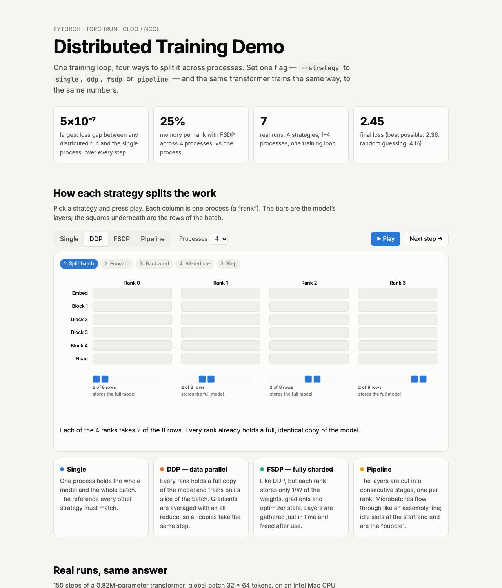
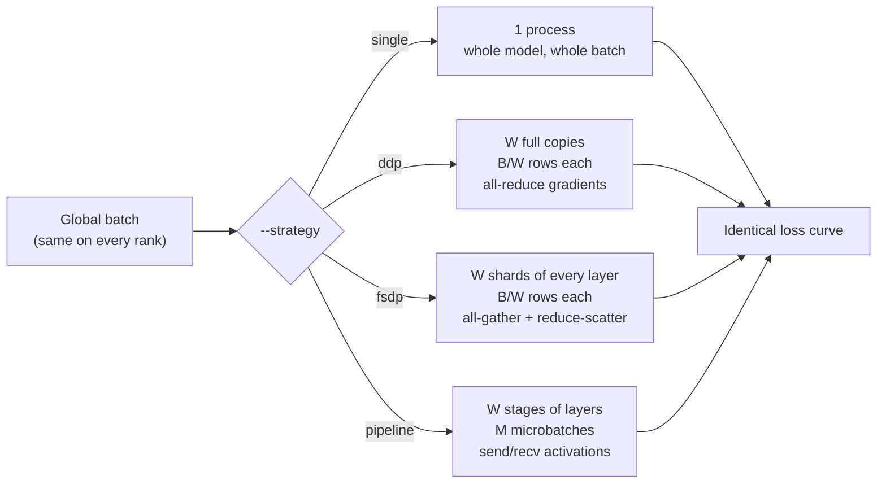

# Distributed Training Demo

One PyTorch training loop, four ways to split it across processes — single, DDP, FSDP and pipeline — and proof that they all train the exact same model.

- **Live site:** https://amalmehta.github.io/DistributedTraining/
- [Instructions](docs/INSTRUCTIONS.md) — setup, run, test, benchmark
- [System design](docs/SYSTEM-DESIGN.md) — architecture, flows, decisions, limits
- [File structure](docs/FILE-STRUCTURE.md) — what's where
