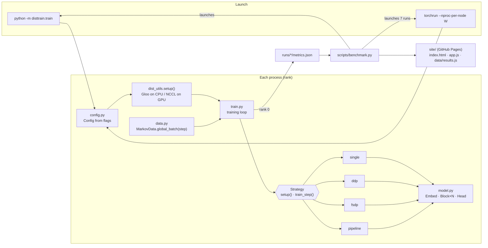

# Distributed Training Demo — System Design

## What it is

A small PyTorch package that trains one transformer with one training loop, and lets the work be
split four ways — single process, DDP, FSDP or pipeline — by changing `--strategy`. A static
website explains each strategy with animated diagrams and shows results from real runs, including
the main claim: every strategy produces the same loss as the single process at every step.

## Architecture

## Components

| Component | Job |
|---|---|
| `config.py` | One `Config` dataclass; every field becomes a `--flag`. |
| `dist_utils.py` | Detects `torchrun` (via `RANK`), joins the process group, picks device and backend, splits CPU threads between local processes. Without `torchrun` it returns a world of one. |
| `data.py` | `MarkovData` draws sequences from a fixed random Markov chain. Any rank can rebuild the global batch for step *s* from `(data_seed, s)`, so no data has to be sent between processes. Also computes the chain's entropy rate — the best achievable loss. |
| `model.py` | `TinyGPT` as a flat `ModuleList`: `Embed`, `Block × n_layers`, `Head`. The flat list is what lets FSDP wrap per-Block and the pipeline cut into stages. `build_model` seeds before construction so every rank starts from identical weights. |
| `strategies/base.py` | The `Strategy` interface (`setup`, `train_step`, `comm_bytes_per_step`) plus shared helpers: AdamW, the data-parallel row slice, and memory accounting from the tensors the rank actually holds. |
| `strategies/single.py` | Whole model, whole batch, one process. |
| `strategies/ddp.py` | `DistributedDataParallel`; each rank trains on `global_batch / W` rows; gradients are all-reduced during backward. |
| `strategies/fsdp.py` | `FullyShardedDataParallel` with a `ModuleWrapPolicy({Block})`; the optimizer is created after wrapping so it only sees (and stores Adam state for) local shards. |
| `strategies/pipeline.py` | A hand-written GPipe schedule: `stage_bounds` cuts the layer list into W stages, each step runs M microbatch forwards then M backwards with blocking `send`/`recv`; the last stage broadcasts the loss. |
| `train.py` | The loop: fetch global batch → `strategy.train_step` → record loss and time. At the end, all ranks' memory/comm reports are gathered and rank 0 writes `metrics.json`. |
| `scripts/benchmark.py` | Runs single, DDP×2/4, FSDP×2/4, pipeline×2/4 through real `torchrun`, computes each run's max loss gap vs single, writes `site/data/results.{json,js}`. |
| `site/` | Static page. `app.js` draws the strategy diagrams as SVG (rank columns for single/DDP/FSDP; a GPipe time chart with a microbatch slider for pipeline) and the result charts with Chart.js. |

## Main flows

**A training step (any strategy).** The loop asks `MarkovData` for the global batch of step *s*
(every rank gets the same tensor). The strategy then:

- *single*: forward/backward on all rows, AdamW step.
- *ddp*: take rows `[r·B/W, (r+1)·B/W)`, forward/backward; DDP averages gradients with an
  all-reduce overlapped with backward; every rank steps identically. Loss is all-reduced only for
  logging.
- *fsdp*: same row slice; FSDP all-gathers each Block's parameters before its forward (and again
  before its backward), frees them after, reduce-scatters gradients so each rank keeps its shard;
  AdamW updates only the local shard.
- *pipeline*: the batch is chunked into M microbatches. Stage 0 embeds tokens; every stage
  receives activations from rank−1, runs its layers, sends to rank+1. The last stage computes
  `loss / M` per microbatch. Backward goes in reverse with activation gradients. Each stage steps
  its own optimizer.

**Benchmark → site.** `benchmark.py` launches each configuration, reads every `metrics.json`,
adds `max_diff_vs_single`, and writes the combined list. The page loads `data/results.js`
(a `window.RESULTS = …` copy, so it also works from `file://`) and renders tiles, charts and a
table.

## Where data lives

| Data | Location | Lifetime |
|---|---|---|
| Training batches | generated in memory per step | discarded after the step |
| Model, gradients, optimizer state | process memory (CPU or GPU) | the run |
| Per-run metrics | `runs/<strategy>-<world>/metrics.json` | git-ignored, overwritten by the next benchmark |
| Site data | `site/data/results.json` and `results.js` | committed; refreshed by the benchmark |

No checkpoints are written; there is no database or server.

## Key decisions and trade-offs

- **Global batch in, strategy decides the split.** The loop is identical for every strategy, and
  each strategy is equivalent to single-process training by construction (equal row slices, mean
  losses, `loss / M` per microbatch). Trade-off: no `DistributedSampler`/`DataLoader`; fine for
  synthetic data, a real corpus would need one.
- **Synthetic Markov data.** No downloads, deterministic on every rank, and a known loss floor to
  plot. Trade-off: it's a toy task — the model learns bigram statistics, not language.
- **Same seed, build the full model everywhere.** Guarantees identical initial weights, which is
  what makes exact equivalence checks possible. Trade-off: the pipeline briefly builds layers it
  then discards; FSDP shards after construction instead of using meta-device init. Both are wrong
  for models that don't fit in one process's memory.
- **Pipeline written by hand.** `torch.distributed.pipelining` needs PyTorch ≥ 2.4, which has no
  Intel-Mac build; the hand-written GPipe schedule is also easier to read. Trade-off: GPipe only
  (no 1F1B), blocking send/recv (no compute/comm overlap), activation shape assumed fixed.
- **FSDP1 API (`FullyShardedDataParallel`) instead of FSDP2 (`fully_shard`).** Same reason: FSDP2
  arrived in PyTorch 2.4. `use_orig_params=False` so `parameters()` yields the local flat shards
  and memory accounting is exact.
- **Communication volume is a formula, not a measurement.** Gloo has no byte counters. DDP:
  2(W−1)/W × model; FSDP: 3(W−1)/W × model; pipeline: activation size per boundary, each way.
- **CPU threads split between local processes**, so a 4-process run doesn't oversubscribe the
  cores. The single run uses PyTorch's default thread count.
- **Static site with data baked in.** Works on GitHub Pages and from disk; no backend to run.

## How it's tested

`tests/test_disttrain.py` (`pytest`, ~3 min):

- data batches are deterministic and targets are inputs shifted by one;
- the entropy floor lies between 0 and log(vocab);
- `stage_bounds` covers every layer exactly once, balances blocks, rejects too many stages;
- the single run's loss goes down;
- DDP×2, FSDP×2, pipeline×2 and pipeline×4, launched through real `torchrun`, match the
  single-process loss at every step within 1e-4 (in practice ~5e-7);
- FSDP×2 holds at most half the parameters per rank.

The benchmark repeats the equivalence check at full size for every configuration; the site shows
the largest gap.

The site was checked in a browser at desktop and phone width, light and dark.

## Known limits

- Only CPU (Gloo) has actually been run. The CUDA/NCCL paths follow the standard PyTorch
  pattern but are untested here.
- On one laptop CPU all "processes" share the same cores, so throughput numbers show overhead,
  not scaling.
- No checkpoint/resume, no mixed precision, no gradient clipping, no tensor parallelism, and no
  combined strategies (e.g. pipeline + data parallel).
- Pipeline: GPipe schedule only, stages balanced by block count rather than measured cost, and
  every stage stores activations for all M microbatches.
- The pipeline diagram assumes forward and backward take equal time; in reality backward takes
  about twice as long.
